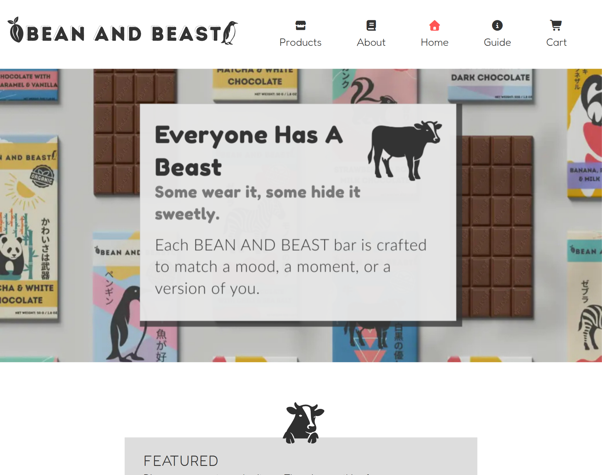
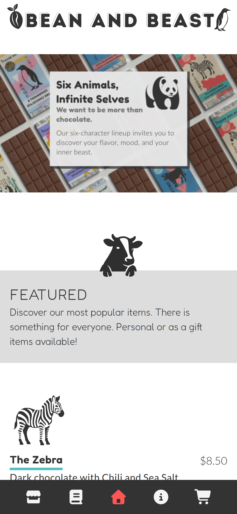

# Bean & Beast

**Live Site**: [Bean & Beast](https://dev-jlagunas.github.io/bean-and-beast/#/)

Bean & Beast is a fictional premium chocolate brand built as the capstone project of my UX design portfolio. This full product concept was created entirely from scratch using the design thinking framework, from user research, branding, and product storytelling, to high-fidelity wireframes, UI mockups, and frontend development.

The site was built using Vue 3, JavaScript, and styled with Tailwind CSS. I placed special emphasis on accessibility, skimmability, and reusable UI components. The site is structured with clean logic, modular components, and a centralized data store.

Bean & Beast is more than a design project. It’s a fully imagined brand with character-driven storytelling and original artwork. I built it to prove that I am ready to work professionally as a UX designer and front-end developer.

---

## Features

- **Fully Imagined Brand**: A fictional chocolate company inspired by six original animal artworks. Each character drives both narrative and flavor identity.
- **Responsive Design**: Optimized for desktop and mobile, including tested layouts for iPhone 12 screen sizes.
- **Reusable Components**: Custom components for section titles, buttons, modals, and CTAs helped streamline layout across all views.
- **Global State Management**: Pinia store holds all product, merch, and lore data in one clean source of truth.
- **Dynamic Product Pages**: Set logic, single-bar logic, and cart functionality adjust dynamically depending on product type.
- **Tailwind Custom Classes**: Global styles built with `@apply` to ensure consistent UI and easier maintenance.
- **Carousel Functionality**: Used Swiper.js to implement visually rich carousels on home and product pages.
- **Clean Code Structure**: Organized files by category and view, with logical folder separation and clear naming conventions.
- **UX Thinking Throughout**: Every decision — from code structure to color palette — was rooted in user experience thinking.

## Screenshots

### Desktop

  
  

## Recommended IDE Setup

[VSCode](https://code.visualstudio.com/) + [Volar](https://marketplace.visualstudio.com/items?itemName=Vue.volar) (and disable Vetur).

## Customize Configuration

See [Vite Configuration Reference](https://vitejs.dev/config/).

## Installation and Setup Instructions

Clone down this repository. You will need `node` and `npm` installed globally on your machine.

- **Install project dependencies:** `npm install`
- **To Start Server:** `npm run dev`
- **To Visit App:** `http://localhost:5173`

## Contributing

This project was built as a solo UX case study and developer capstone. While it is not intended for expansion, feedback is always welcome. Feel free to open an issue if you see bugs or areas for improvement.

## License

This project is licensed under the terms of the MIT License. See the [LICENSE](LICENSE) file for details.

## Contact

**Juan Lagunas** - [GitHub](https://github.com/dev-jLagunas)

Email: dev.jlagunas@gmail.com

If you have any questions about the project or just want to talk UX or design systems, feel free to reach out.

For more of my work, check out my [GitHub profile](https://github.com/dev-jLagunas) or visit my Frontend Mentor profile for other projects I've done: [FrontendMentor](https://www.frontendmentor.io/profile/dev-jLagunas)

## Acknowledgements

- Thanks to [Vue](https://vuejs.org/)
- Thanks to all the contributors who have helped with this project.
- Thanks to anyone who takes the come to checkout my work.
- Thanks to my wife for giving me the opportunity to spend so much time in front of a computer.
